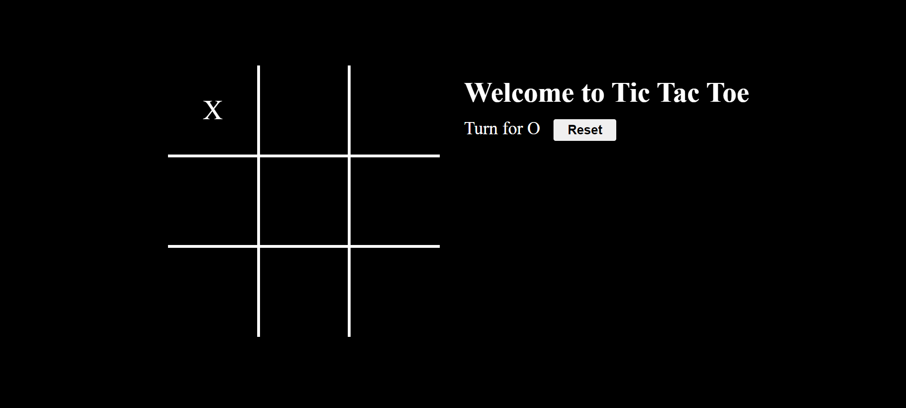
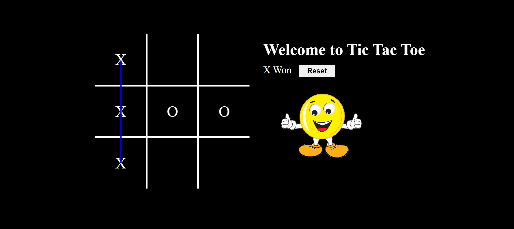

# TicTacToe

Welcome to the TicTacToe Game! 

## Description

A simple Tic-Tac-Toe game built with HTML, CSS, Javascript. This application allows two players to play Tic-Tac-Toe in a user-friendly interface.

## Features

- Play Tic-Tac-Toe with a friend
- Interactive and responsive UI
- Display game status and winner
- Reset game for a new match
- Audio play when game start and when user win the game

## Technologies Used

- **Frontend**: HTML, CSS, JavaScript

## Screenshots

To provide a better understanding of the Recipe Book application, here is a screenshot:

##Main Interface

##Winner Interface

Feel free to customize this template according to your project's specific needs and details!

For any inquiries, please contact:

Name: Gauranshi Varshney
Email: gauranshivarshney@gmail.com
